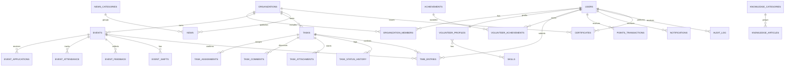

# ER-диаграмма UnityAid

```mermaid
erDiagram
  USERS ||--o{ ORGANIZATION_MEMBERS : has
  ORGANIZATIONS ||--o{ ORGANIZATION_MEMBERS : includes
  ORGANIZATIONS ||--o{ EVENTS : owns
  ORGANIZATIONS ||--o{ TASKS : owns
  ORGANIZATIONS ||--o{ NEWS : publishes
  USERS ||--|| VOLUNTEER_PROFILES : profile
  VOLUNTEER_PROFILES }o--o{ SKILLS : has
  EVENTS ||--o{ EVENT_APPLICATIONS : receives
  EVENTS ||--o{ EVENT_ATTENDANCE : tracks
  EVENTS ||--o{ EVENT_FEEDBACK : collects
  EVENTS ||--o{ EVENT_SHIFTS : has
  TASKS ||--o{ TASK_ASSIGNMENTS : assigns
  TASKS ||--o{ TASK_COMMENTS : discusses
  TASKS ||--o{ TASK_ATTACHMENTS : stores
  TASKS ||--o{ TASK_STATUS_HISTORY : logs
  USERS ||--o{ TIME_ENTRIES : submits
  EVENTS ||--o{ TIME_ENTRIES : confirms
  TASKS ||--o{ TIME_ENTRIES : confirms
  USERS ||--o{ VOLUNTEER_ACHIEVEMENTS : earns
  ACHIEVEMENTS ||--o{ VOLUNTEER_ACHIEVEMENTS : awarded
  USERS ||--o{ POINTS_TRANSACTIONS : receives
  USERS ||--o{ NOTIFICATIONS : receives
  USERS ||--o{ AUDIT_LOG : performs
  USERS ||--o{ CERTIFICATES : receives
  ORGANIZATIONS ||--o{ CERTIFICATES : issues
  KNOWLEDGE_CATEGORIES ||--o{ KNOWLEDGE_ARTICLES : groups
  NEWS_CATEGORIES ||--o{ NEWS : groups
```
